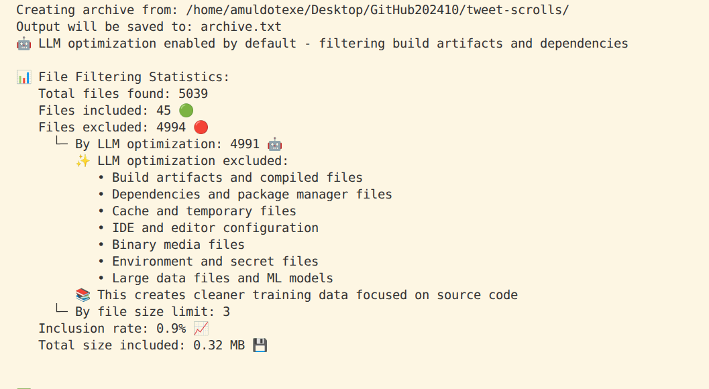

# 🧙‍♂️ Interview Irodov Toolkit

**Production-ready Rust workspace for code archiving, analysis, and processing**

[](LICENSE-APACHE)
[](https://www.rust-lang.org)
[](#testing)
[](#testing)

## 🎯 What It Does

A comprehensive Rust workspace providing four specialized tools for code processing: create text archives with intelligent filtering, analyze project structure with Git integration, compress TypeScript files, and split large files - all with parallel processing and rich CLI feedback.

```bash
# Create text archive with LLM-optimized filtering
cargo run -p archive-to-txt --release -- --input ./my-project --output archive.txt

# example

cargo run -p archive-to-txt --release -- --input ~/Desktop/GitHub202410/tweet-scrolls/ --output archive.txt

# results



# Archive with TypeScript processing and intelligent filtering
cargo run -p ts-compressor --release -- archive ./my-project

# Analyze codebase structure with Git status tracking
cargo run -p code-archiver --release -- --dir ./my-project --format json

# Split large files with configurable chunk sizes
cargo run -p file-splitter --release -- --input large-file.txt --chunk-size 10MB
```

## 🚀 Quick Start

```bash
# Clone and run immediately
git clone <repository-url>
cd interview-irodov

# Create text archive with parallel processing
cargo run -p archive-to-txt --release -- --input ./my-project --output archive.txt

# Archive with TypeScript processing and LLM optimization
cargo run -p ts-compressor --release -- archive ./my-project

# Analyze project structure with Git integration
cargo run -p code-archiver --release -- --dir ./my-project --format json
```

## ✨ Why Use This Toolkit

- **🚀 Fast**: Parallel processing with Rayon handles large codebases efficiently
- **🤖 Smart**: Intelligent filtering with Git integration and binary detection
- **📊 Transparent**: Rich CLI experience with detailed progress feedback
- **🔒 Safe**: Memory-safe Rust with comprehensive error handling using anyhow/thiserror
- **🧪 Tested**: 115+ tests across workspace ensuring reliability and correctness

## 🛠️ Tools Overview

| Tool | Purpose | Key Features | Best For |
|------|---------|--------------|----------|
| `archive-to-txt` | Text archive creation | Parallel processing, Git integration, directory tree visualization | Documentation, searchable archives |
| `ts-compressor` | TypeScript compilation & archiving | SWC-based compilation, LLM-optimized filtering, timestamped archives | TypeScript projects, LLM training data |
| `code-archiver` | Project structure analysis | Git status tracking, JSON/text output, glob pattern filtering | Project metrics, codebase analysis |
| `file-splitter` | Large file splitting | Configurable chunk sizes, progress tracking, size parsing | Processing large datasets, file management |

### 🌟 Featured Tool: archive-to-txt

The `archive-to-txt` is our flagship tool for creating comprehensive text archives:

```bash
# Create text archive with parallel processing and Git integration
cargo run -p archive-to-txt --release -- \
  --input ./my-project \
  --output archive.txt \
  --show-filter-stats

# Features:
# ✅ Parallel processing with Rayon
# ✅ Git integration (respects .gitignore)
# ✅ Directory tree visualization
# ✅ Binary file detection and handling
# ✅ LLM-optimized filtering (optional)
# ✅ Configurable extensions and patterns
# ✅ Rich statistics and progress feedback
```

## Common Use Cases

### For Documentation
```bash
# Create comprehensive project documentation
cargo run -p archive-to-txt --release -- \
  --input ./my-project \
  --output ./docs/codebase.txt \
  --include-extensions "rs,md,toml"
```

### For Code Analysis  
```bash
# Generate detailed project metrics with Git status
cargo run -p code-archiver --release -- \
  --dir ./my-project \
  --format json \
  --extensions rs js ts py
```

### For TypeScript Processing
```bash
# Compress TypeScript files to minified JavaScript
cargo run -p ts-compressor --release -- compress input_dir output_dir

# Create archive with TypeScript-aware processing
cargo run -p ts-compressor --release -- archive ./my-project
```

## Installation Options

### Run Without Installing (Recommended)
```bash
git clone <repository-url>
cd interview-irodov
cargo run -p <tool-name> --release -- [options]
```

### Install to PATH
```bash
cargo install --path archive-to-txt
cargo install --path code-archiver  
cargo install --path ts-compressor
cargo install --path file-splitter
```

### Use as Library
```toml
[dependencies]
archive-to-txt = { path = "./archive-to-txt" }
code-archiver = { path = "./code-archiver" }
```

## Performance

The toolkit is designed for efficient processing with parallel execution:

- **Parallel Processing**: Uses Rayon for multi-threaded file processing
- **Memory Efficient**: Streaming processing for large files
- **Git Integration**: Respects .gitignore for faster traversal
- **Binary Detection**: Skips binary files to focus on text content
- **Configurable Limits**: Adjustable file size and processing limits

## Configuration

Each tool supports command-line configuration:

```bash
# archive-to-txt: Configure filtering and processing
cargo run -p archive-to-txt -- \
  --input ./project \
  --output archive.txt \
  --include-extensions "rs,js,ts" \
  --ignore-pattern "target/**" \
  --ignore-pattern "node_modules/**"

# code-archiver: Configure analysis options
cargo run -p code-archiver -- \
  --dir ./project \
  --include "*.rs" \
  --exclude "target/**" \
  --extensions rs js ts \
  --format json
```

## Advanced Examples

### Complete Analysis Pipeline
```bash
#!/bin/bash
PROJECT="./my-project"
OUTPUT="./analysis_$(date +%Y%m%d)"

# 1. Create text archive
cargo run -p archive-to-txt --release -- --input "$PROJECT" --output "$OUTPUT/archive.txt"

# 2. Generate structure analysis  
cargo run -p code-archiver --release -- --dir "$PROJECT" --format json > "$OUTPUT/analysis.json"

# 3. Process TypeScript if present
cargo run -p ts-compressor --release -- archive "$PROJECT"

# 4. Split large files if needed
find "$OUTPUT" -size +50M -exec cargo run -p file-splitter --release -- --input {} --chunk-size 50MB \;
```

### Programmatic Usage
```rust
use archive_to_txt::{archive_directory, config::Config};

fn main() -> Result<(), Box<dyn std::error::Error>> {
    let config = Config::default()
        .with_parallel(true)
        .with_llm_optimize(true)
        .with_include_extensions(Some("rs,js,ts".to_string()));
    
    let stats = archive_directory("./my-project", "./archive.txt", &config)?;
    
    println!("Processed {} files", stats.files_processed);
    Ok(())
}
```

## 🧪 Testing

Our toolkit includes comprehensive test coverage ensuring reliability and correctness:

### Test Suite Overview

```bash
# Run all tests across the workspace
cargo test --workspace

# Run specific tool tests
cargo test -p ts-compressor
cargo test -p code-archiver
cargo test -p archive-to-txt
cargo test -p file-splitter

# Run integration tests with detailed output
cargo test --test integration_system_tests -- --nocapture
```

### Test Coverage Statistics

| Component | Unit Tests | Integration Tests | Test Files |
|-----------|------------|-------------------|------------|
| `ts-compressor` | Multiple unit tests | 1 integration test file | 1 test file |
| `code-archiver` | Multiple unit tests | 7 integration test files | 7 test files |
| `archive-to-txt` | Multiple unit tests | 1 parallel test file | 1 test file |
| `file-splitter` | Multiple unit tests | 1 integration test file | 1 test file |
| `common` | Multiple unit tests | 2 test files | 2 test files |
| **Total** | **115+ individual tests** | **12 test files** | **Comprehensive coverage** |

### Integration Test Categories

Our integration tests cover real-world scenarios:

1. **CLI Experience Tests**
   - Command-line argument parsing
   - Help system functionality
   - Error message clarity
   - Output formatting validation

2. **File Processing Tests**
   - Large codebase handling
   - Binary file detection
   - Git repository integration
   - Permission handling

3. **Filtering System Tests**
   - LLM optimization patterns
   - Custom ignore patterns
   - Extension filtering
   - Statistics accuracy

4. **Performance Tests**
   - Memory usage validation
   - Processing speed benchmarks
   - Parallel processing efficiency
   - Resource limit handling

### Running Specific Test Categories

```bash
# Test CLI experience and user interface
cargo test cli_experience

# Test file processing and filtering
cargo test file_processing

# Test performance and memory usage
cargo test --release performance_tests

# Test error handling and edge cases
cargo test error_handling
```

## 🔧 Development

### Prerequisites

- Rust 1.70+ (latest stable recommended)
- Git (for repository processing features)
- Optional: `tree` command for enhanced directory visualization

### Building from Source

```bash
# Clone the repository
git clone <repository-url>
cd interview-irodov

# Build all tools in release mode
cargo build --release --workspace

# Build specific tool
cargo build --release -p ts-compressor

# Run with debug logging
RUST_LOG=debug cargo run -p ts-compressor -- archive ./test-input
```

### Code Quality Standards

```bash
# Format all code
cargo fmt --all

# Run linter with strict warnings
cargo clippy --all-targets -- -D warnings

# Check for security vulnerabilities
cargo audit

# Generate documentation
cargo doc --no-deps --open
```

### Performance Profiling

```bash
# Profile memory usage
cargo test --release memory_usage_tests

# Benchmark processing speed
cargo bench

# Profile with valgrind (Linux)
valgrind --tool=massif cargo run --release -p ts-compressor -- archive large-project
```

## 📚 Documentation

- **[Comprehensive Guide](READMELong.md)** - Detailed documentation with examples
- **[API Reference](https://docs.rs/interview-irodov)** - Generated documentation  
- **[Contributing Guidelines](CONTRIBUTING.md)** - Development and contribution guide
- **[Performance Benchmarks](BENCHMARKS.md)** - Detailed performance analysis
- **[Architecture Overview](ARCHITECTURE.md)** - System design and patterns

## License

Dual-licensed under [MIT](LICENSE-MIT) or [Apache-2.0](LICENSE-APACHE)